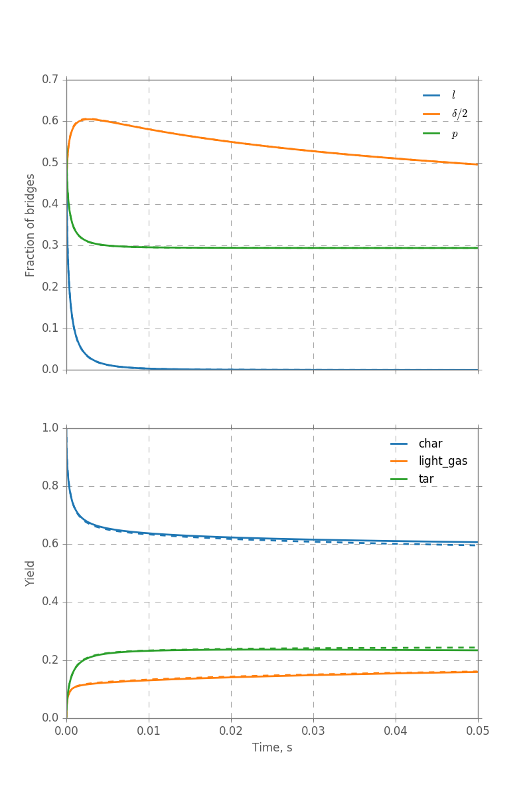

# CPD model

Python implemetation of the Chemical Percolation Devolatilization (**CPD**) model.
The original model was developed in Fortran at BYU: http://www.et.byu.edu/~tom/devolatilization/CPD%20model.html

The model requires **PKP** as dependencies (ask for having access).

